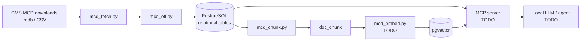

# mcd-rag

> Local-first RAG for Medicare coverage and coding policy: loads the CMS Medicare Coverage Database (LCDs, Articles, NCDs) into PostgreSQL + pgvector, with an agentic example for coverage and coding questions.

<!-- TODO: badges (python version, license, CI) -->
<!-- TODO: repo name decision: `mcd-rag` vs `medicare-coverage-rag` -->

**Status:** early draft. See [What's implemented](#whats-implemented).

---

## 1. Overview

### What this is

A pipeline and schema that turn the CMS **Medicare Coverage Database (MCD)** bulk downloads into a queryable knowledge base:

- **Relational layer** (PostgreSQL): documents, MACs, jurisdictions, and every code list (CPT/HCPCS, ICD-10-CM/PCS, revenue, bill type), queryable by exact code and state.
- **Vector layer** (pgvector): chunked policy text with embeddings, for semantic and hybrid (vector + keyword) search.
- **Agent layer** *(TODO)*: an MCP server and an example agent that combine the two.

Everything is designed to run on a single laptop with local models.

### The data

The MCD is CMS's repository of coverage policy. It is published as weekly bulk downloads (Access `.mdb` and CSV) at <https://www.cms.gov/medicare-coverage-database/downloads/downloads.aspx>.

| Document type | Written by | Scope | What it contains |
|---|---|---|---|
| **NCD** (National Coverage Determination) | CMS | National | Whether Medicare covers an item/service, and under what conditions |
| **LCD** (Local Coverage Determination) | A regional MAC | One MAC's jurisdiction | Local medical-necessity criteria, documentation requirements |
| **Article** | A regional MAC | One MAC's jurisdiction | Billing and coding guidance, including the ICD-10 and CPT/HCPCS code lists that back an LCD |

Snapshot used during development (data as of 09/27/2026): ~980 LCDs, ~2,070 Articles, 357 NCD versions, ~510k code rows, ~52k text chunks for active documents. Full data dictionaries are in the downloads page; the schema is in [`server/mcd_schema.sql`](server/mcd_schema.sql).

### Why this is a good RAG use case

- **The corpus is large, public, and updated weekly.** A model's training data can't keep up with it.
- **The answer depends on where you are.** The same service can be covered under one MAC's LCD and restricted under another's. Jurisdiction has to be a hard filter, not something the LLM guesses.
- **The answer lives in two places.** The *rules* are prose in LCDs; the *codes* are structured lists in Articles. Answering "is CPT X covered for diagnosis Y in state Z" means joining them.
- **Exact matches matter.** Code lookups must be exact (SQL), while "what documentation do I need for…" is semantic (vectors). This project uses both, which is a better pattern than embedding everything.
- **Answers need citations.** Every chunk traces back to a document ID, section, and source table.
- **Documents cross-reference each other** (LCD ↔ Article ↔ NCD), which suits multi-step agentic retrieval.

### Architecture



### Important notes for users of this project

**Licensing: read this before using or sharing anything derived from the data.**
The MCD downloads are public, but they embed content owned by third parties, and CMS requires you to accept their licenses on the downloads page:

- **CPT®**: © American Medical Association. The CMS license grants **personal, non-commercial use** and prohibits redistribution and derivative works.
- **CDT®**: © American Dental Association. The CMS license is limited to internal use in CMS-administered programs and restricts distributing outputs (including AI outputs) that embed CDT content to commercial third parties.
- **UB-04 data** (bill types, revenue codes): © American Hospital Association / NUBC, with similar restrictions.

This repository contains **code only**. It does not include or redistribute any MCD data; you download it yourself. Treat any database you build as personal/research use. Don't host it publicly or commercially without your own licenses. *(This is a summary, not legal advice.)*

**Code descriptions.**
- Descriptions come from the policy documents themselves. There is **no standalone ICD-10 / HCPCS code master** in the downloads, so a code that no policy references has no description here.
- Descriptions reflect the code-set version the MAC last published. ICD-10 changes every October 1, so an older policy may carry stale text.
- The `code_ref` table is provided for loading official code sets (ICD-10-CM/PCS and HCPCS Level II are public). CPT descriptions require an AMA license. *(TODO: loader script.)*

**Scope and freshness.**
- LCD and Article downloads contain **only the latest version** of each document. Older versions are in the MCD Archive and aren't loaded. NCDs include all versions.
- Datasets refresh weekly (Thursdays). Re-run the pipeline to stay current.
- NCDs do not contain claims-processing code lists; those come from CMS change-request transmittals, which aren't part of this dataset.
- For most MACs, codes live in **Articles**, not LCDs. DME MACs are the exception (CPT/HCPCS stay in the LCD).

**Not advice.** This is a research/engineering project. Output is not medical, legal, coding, or billing advice and must not be used to make coverage or claim decisions. Always confirm against the source document in the MCD and with the responsible MAC.

---

## 2. Requirements

### Reference machine

Developed for an **Apple M2 Max, 32 GB RAM** MacBook. Everything (Postgres, embeddings, LLM) runs on it at once.

<!-- TODO: benchmark and fill in a real minimum-spec table -->

| Resource | Rough need | Notes |
|---|---|---|
| RAM | 16 GB workable, 32 GB comfortable | Dominated by the chat LLM; Postgres and embeddings are small |
| Disk | ~5 GB free | Downloads ≈ 350 MB (`.mdb`), Postgres ≈ 560 MB before embeddings, + embeddings and index (~0.3–0.5 GB est.), + model files |
| GPU | Not required | Apple Silicon (Metal) or an NVIDIA GPU speeds up the LLM and embeddings |
| Network | Needed for download and model pulls | Runtime can be fully offline |

### Software

| Component | Version | Purpose |
|---|---|---|
| Python | 3.10+ (developed on 3.12) | ETL, chunking, embedding, MCP server |
| PostgreSQL | 16 | Relational + vector store |
| pgvector | 0.6+ (HNSW index required; newer is better) | Vector similarity |
| mdbtools | any recent | Reads the Access `.mdb` files (`mdb-export`) |
| Ollama | latest | Local LLM and embedding server |

Python packages are in [`ingest/requirements.txt`](ingest/requirements.txt): `psycopg[binary]`, `pgvector`, `beautifulsoup4`, `lxml`, `requests`.
<!-- TODO: add MCP SDK, agent framework (LangGraph?) once chosen -->

### Models

| Role | Suggested | Notes |
|---|---|---|
| Embeddings | `nomic-embed-text` (768-dim) | Matches `vector(768)` in the schema. A different dimension needs a schema change |
| Chat / agent LLM | An instruction-tuned 8B–14B model via Ollama | Rough 4-bit memory: 8B ≈ 5 GB, 14B ≈ 9 GB, 32B ≈ 20 GB |

<!-- TODO: pick and benchmark chat models for tool-calling quality on 32 GB -->

---

## 3. Setup and end-to-end walkthrough

### What's implemented

| Step | Script | Status |
|---|---|---|
| Schema | `server/mcd_schema.sql` | Done, tested on PostgreSQL 16 |
| Download latest datasets | `ingest/mcd_fetch.py` | Done |
| ETL (`.mdb`/CSV to Postgres) | `ingest/mcd_etl.py` | Done, tested on the real `.mdb` files |
| Chunking | `ingest/mcd_chunk.py` | Done, tested on the real data |
| Embedding | `ingest/mcd_embed.py` | **TODO** |
| MCP server | `server/` | **TODO** |
| Agent example | `examples/` | **TODO** |
| Evaluation set | `eval/` | **TODO** |

### Step 1: Install dependencies (macOS)

```bash
brew install postgresql@16 pgvector mdbtools ollama
brew services start postgresql@16
```
<!-- TODO: Linux / Windows (WSL) instructions -->

```bash
git clone <repo-url> && cd mcd-rag
python3 -m venv .venv && source .venv/bin/activate
pip install -r ingest/requirements.txt
```

The commands below are run from the repository root, so datasets land in `./data` there.

### Step 2: Create the database

```bash
createdb mcd
export MCD_DSN="postgresql://localhost/mcd"
```

The schema (and the `vector` / `pg_trgm` extensions) is created by the ETL's `--init-schema` flag in step 4.

### Step 3: Get the data

**Automatic:** `ingest/mcd_fetch.py` scrapes the downloads page for the latest ZIPs, unpacks them into `./data`, and caches by ETag so unchanged datasets are skipped on re-runs. It honors `robots.txt` and requires an explicit license-acceptance flag.

```bash
python ingest/mcd_fetch.py --accept-licenses              # current LCDs, Articles and NCDs
python ingest/mcd_fetch.py --accept-licenses --retired    # "Current and Retired" LCD/Article variants
python ingest/mcd_fetch.py --list                         # show what the downloads page offers
```

It unpacks the `.mdb` files when mdbtools is installed and the CSVs otherwise (`--format` overrides this); `--dest` changes the target directory.

**Manual:**
1. Open the [downloads page](https://www.cms.gov/medicare-coverage-database/downloads/downloads.aspx) and accept the license agreements.
2. Download **Current LCD Data**, **Current Article Data**, and **Current NCD Data**. (The "Current and Retired" variants also work.)
3. Unzip each into `./data/` (the `.mdb` files are what the ETL reads).

```
data/
  current_lcd.mdb
  current_article.mdb
  ncd.mdb
```

### Step 4: Run the ETL

```bash
python ingest/mcd_etl.py --init-schema          # reads ./data by default
# or: python ingest/mcd_etl.py --init-schema --source /path/to/*.mdb
# preview without committing: add --dry-run
```

Expect about a minute or two. The ETL is idempotent and safe to re-run for the weekly refresh. Unchanged documents keep their IDs, so existing chunks and embeddings survive. Some "orphan" rows are skipped and reported (mostly revision history and related-document rows that point at older versions that the downloads don't include). That is expected.

### Step 5: Chunk the text

```bash
python ingest/mcd_chunk.py                       # active, non-draft documents
python ingest/mcd_chunk.py --show L33252         # preview one document's chunks, writes nothing
```

On the development snapshot this produced ~52k chunks (median ~940 characters) in about 20 seconds. Re-running only touches chunks whose text changed.

### Step 6: Host the local models and embed

```bash
ollama serve &                            # skip if already running as a service
ollama pull nomic-embed-text
ollama pull <chat-model>                  # TODO: pick a model
```

```bash
python ingest/mcd_embed.py                       # TODO: not written yet
```
<!-- TODO: expected embedding time on M2 Max; batch size; resume behavior -->

### Step 7: Run the MCP server

<!-- TODO: server/ with read-only Postgres role. Planned tools:
     lookup_code(code, state), search_policies(query, state, doc_type), get_policy(public_id) -->

### Step 8: Run the agent example

<!-- TODO: examples/ -->

### Step 9: Test the pipeline

Run these in `psql "$MCD_DSN"` (after `SET search_path = mcd, public;`).

```sql
-- Row counts look sane
SELECT doc_type, status, count(*) FROM policy_doc GROUP BY 1, 2 ORDER BY 1, 2;

-- Exact code lookup: which active policies list ICD-10 E11.9, in Minnesota?
SELECT DISTINCT public_id, left(title, 70)
FROM v_code_to_policy
WHERE code_system = 'ICD10CM' AND code = 'E11.9' AND 'MN' = ANY(state_abbrevs)
LIMIT 10;

-- Every non-NCD document should have jurisdiction states (expect 0 rows)
SELECT public_id FROM policy_doc
WHERE doc_type <> 'NCD' AND cardinality(state_abbrevs) = 0;

-- Chunks exist for every active document
SELECT count(*) AS docs_without_chunks FROM v_active_policy d
WHERE NOT EXISTS (SELECT 1 FROM doc_chunk c WHERE c.doc_pk = d.doc_pk);
```

NCDs are national, so their `state_abbrevs` is empty by design. Filter with `doc_type = 'NCD' OR 'MN' = ANY(state_abbrevs)`.

<!-- TODO: after embeddings exist - sample vector + keyword search query and expected results -->
<!-- TODO: eval set of ~25 question/answer/citation triples for regression testing -->

### Configuration

| Variable | Default | Purpose |
|---|---|---|
| `MCD_DSN` | `postgresql://localhost/mcd` | Postgres connection string |
| `MCD_DATA_DIR` | `./data` | Where datasets are downloaded to and where the ETL looks for them |

### Weekly refresh

```bash
python ingest/mcd_fetch.py --accept-licenses
python ingest/mcd_etl.py && python ingest/mcd_chunk.py   # && python ingest/mcd_embed.py
```

---

## Repository layout

```
ingest/
  mcd_common.py       shared helpers (DB, HTML-to-text, .mdb/CSV readers)
  mcd_fetch.py        CMS downloads page -> ./data
  mcd_etl.py          datasets -> Postgres
  mcd_chunk.py        policy text -> doc_chunk
  requirements.txt
  # planned: mcd_embed.py
server/
  mcd_schema.sql      PostgreSQL + pgvector schema
  # planned: MCP server
examples/             planned: agent example
eval/                 planned: evaluation set
data/                 downloaded datasets (gitignored; do not commit)
```

## Roadmap

- [x] `mcd_fetch.py`: download latest datasets with explicit license acceptance
- [ ] `mcd_embed.py`: Ollama embeddings with reuse by content hash
- [ ] MCP server with read-only role and focused tools
- [ ] Agentic example (TODO: framework)
- [ ] Code-set loader for the `code_ref` table
- [ ] Evaluation set and retrieval metrics
- [ ] Linux / Windows setup notes

## Troubleshooting

<!-- TODO: mdb-export not found; pgvector extension missing; Ollama connection refused; skipped-row warnings -->

## License

<!-- TODO: choose a license for the code. The data is NOT covered by it - see the licensing notes above. -->

## Acknowledgments

Data: Centers for Medicare & Medicaid Services, Medicare Coverage Database. CPT® is a registered trademark of the American Medical Association.
