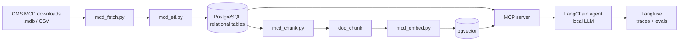

# mcd-rag

> Local-first RAG for Medicare coverage and coding policy: loads the CMS Medicare Coverage Database (LCDs, Articles, NCDs) into PostgreSQL + pgvector, with an agentic example for coverage and coding questions.

<!-- TODO: badges (python version, license, CI) -->
<!-- TODO: repo name decision: `mcd-rag` vs `medicare-coverage-rag` -->

**Status:** early draft. See [What's implemented](#whats-implemented).

---

## 1. Overview

### What this is

A pipeline and schema that turn the CMS **Medicare Coverage Database (MCD)** bulk downloads into a queryable knowledge base:

- **Relational layer** (PostgreSQL): documents, MACs, jurisdictions, and every code list (CPT/HCPCS, ICD-10-CM/PCS, revenue, bill type), queryable by exact code and state.
- **Vector layer** (pgvector): chunked policy text with embeddings, for semantic and hybrid (vector + keyword) search.
- **Agent layer**: an MCP server that combines the two, and an example LangChain agent with a Langfuse evaluation.

Everything is designed to run on a single laptop with local models.

### The data

The MCD is CMS's repository of coverage policy. It is published as weekly bulk downloads (Access `.mdb` and CSV) at <https://www.cms.gov/medicare-coverage-database/downloads/downloads.aspx>.

| Document type | Written by | Scope | What it contains |
|---|---|---|---|
| **NCD** (National Coverage Determination) | CMS | National | Whether Medicare covers an item/service, and under what conditions |
| **LCD** (Local Coverage Determination) | A regional MAC | One MAC's jurisdiction | Local medical-necessity criteria, documentation requirements |
| **Article** | A regional MAC | One MAC's jurisdiction | Billing and coding guidance, including the ICD-10 and CPT/HCPCS code lists that back an LCD |

Snapshot used during development (data as of 09/27/2026): ~980 LCDs, ~2,070 Articles, 357 NCD versions, ~510k code rows, ~52k text chunks for active documents. Full data dictionaries are in the downloads page; the schema is in [`server/mcd_schema.sql`](server/mcd_schema.sql).

### Why this is a good RAG use case

- **The corpus is large, public, and updated weekly.** A model's training data can't keep up with it.
- **The answer depends on where you are.** The same service can be covered under one MAC's LCD and restricted under another's. Jurisdiction has to be a hard filter, not something the LLM guesses.
- **The answer lives in two places.** The *rules* are prose in LCDs; the *codes* are structured lists in Articles. Answering "is CPT X covered for diagnosis Y in state Z" means joining them.
- **Exact matches matter.** Code lookups must be exact (SQL), while "what documentation do I need for…" is semantic (vectors). This project uses both, which is a better pattern than embedding everything.
- **Answers need citations.** Every chunk traces back to a document ID, section, and source table.
- **Documents cross-reference each other** (LCD ↔ Article ↔ NCD), which suits multi-step agentic retrieval.

### Architecture



### Important notes for users of this project

**Licensing: read this before using or sharing anything derived from the data.**
The MCD downloads are public, but they embed content owned by third parties, and CMS requires you to accept their licenses on the downloads page:

- **CPT®**: © American Medical Association. The CMS license grants **personal, non-commercial use** and prohibits redistribution and derivative works.
- **CDT®**: © American Dental Association. The CMS license is limited to internal use in CMS-administered programs and restricts distributing outputs (including AI outputs) that embed CDT content to commercial third parties.
- **UB-04 data** (bill types, revenue codes): © American Hospital Association / NUBC, with similar restrictions.

This repository contains **code only**. It does not include or redistribute any MCD data; you download it yourself. Treat any database you build as personal/research use. Don't host it publicly or commercially without your own licenses. *(This is a summary, not legal advice.)*

**Code descriptions.**
- Descriptions come from the policy documents themselves. There is **no standalone ICD-10 / HCPCS code master** in the downloads, so a code that no policy references has no description here.
- Descriptions reflect the code-set version the MAC last published. ICD-10 changes every October 1, so an older policy may carry stale text.
- The `code_ref` table is provided for loading official code sets (ICD-10-CM/PCS and HCPCS Level II are public). CPT descriptions require an AMA license. *(TODO: loader script.)*

**Scope and freshness.**
- LCD and Article downloads contain **only the latest version** of each document. Older versions are in the MCD Archive and aren't loaded. NCDs include all versions.
- Datasets refresh weekly (Thursdays). Re-run the pipeline to stay current.
- NCDs do not contain claims-processing code lists; those come from CMS change-request transmittals, which aren't part of this dataset.
- For most MACs, codes live in **Articles**, not LCDs. DME MACs are the exception (CPT/HCPCS stay in the LCD).

**Not advice.** This is a research/engineering project. Output is not medical, legal, coding, or billing advice and must not be used to make coverage or claim decisions. Always confirm against the source document in the MCD and with the responsible MAC.

---

## 2. Requirements

### Reference machine

Developed for an **Apple M2 Max, 32 GB RAM** MacBook. Everything (Postgres, embeddings, LLM) runs on it at once.

<!-- TODO: benchmark and fill in a real minimum-spec table -->

| Resource | Rough need | Notes |
|---|---|---|
| RAM | 16 GB workable, 32 GB comfortable | Dominated by the chat LLM; Postgres and embeddings are small |
| Disk | ~5 GB free | Downloads ≈ 350 MB (`.mdb`), Postgres ≈ 560 MB before embeddings, + embeddings and index (~0.3–0.5 GB est.), + model files |
| GPU | Not required | Apple Silicon (Metal) or an NVIDIA GPU speeds up the LLM and embeddings |
| Network | Needed for download and model pulls | Runtime can be fully offline |

### Software

| Component | Version | Purpose |
|---|---|---|
| Python | 3.10+ (developed on 3.12) | ETL, chunking, embedding, MCP server |
| PostgreSQL | 17 | Relational + vector store |
| pgvector | 0.6+ (HNSW index required; newer is better) | Vector similarity |
| mdbtools | any recent | Reads the Access `.mdb` files (`mdb-export`) |
| Ollama | latest | Local LLM and embedding server |

Python packages are in [`ingest/requirements.txt`](ingest/requirements.txt) (`psycopg[binary]`, `pgvector`, `beautifulsoup4`, `lxml`, `requests`), [`server/requirements.txt`](server/requirements.txt) (`mcp` 2.x, `psycopg[binary]`, `requests`) and [`examples/requirements.txt`](examples/requirements.txt) (`langchain` 1.x, `langchain-ollama`, `langfuse` 4.x), which the agent example and the evaluation share.

### Models

| Role | Suggested | Notes |
|---|---|---|
| Embeddings | `nomic-embed-text` (768-dim) | Matches `vector(768)` in the schema. A different dimension needs a schema change |
| Chat / agent LLM | A tool-calling model via Ollama; the example defaults to `gpt-oss:20b` (≈ 14 GB) | Rough 4-bit memory: 8B ≈ 5 GB, 14B ≈ 9 GB, 32B ≈ 20 GB. Set `MCD_CHAT_MODEL` to use another |

<!-- TODO: pick and benchmark chat models for tool-calling quality on 32 GB -->

---

## 3. Setup and end-to-end walkthrough

### What's implemented

| Step | Script | Status |
|---|---|---|
| Schema | `server/mcd_schema.sql` | Done, tested on PostgreSQL 16 |
| Download latest datasets | `ingest/mcd_fetch.py` | Done |
| ETL (`.mdb`/CSV to Postgres) | `ingest/mcd_etl.py` | Done, tested on the real `.mdb` files |
| Chunking | `ingest/mcd_chunk.py` | Done, tested on the real data |
| Embedding | `ingest/mcd_embed.py` | Done, **not yet run against a real database** |
| Fetch + ETL + chunking + embedding in one command | `ingest/mcd_pipeline.py` | Done |
| MCP server | `server/mcd_server.py` | Done |
| Agent example | `examples/mcd_agent.py` | Done |
| Evaluation set and Langfuse experiment | `eval/mcd_eval_set.jsonl`, `eval/mcd_eval.py` | Done, **not yet run against a Langfuse instance** |

### Step 1: Install dependencies (macOS)

```bash
brew install postgresql@17 pgvector mdbtools ollama
brew services start postgresql@17
```
<!-- TODO: Linux / Windows (WSL) instructions -->

```bash
git clone <repo-url> && cd mcd-rag
python3 -m venv .venv && source .venv/bin/activate
pip install -r ingest/requirements.txt
```

The commands below are run from the repository root, so datasets land in `./data` there.

### Step 2: Create the database

```bash
createdb mcd
export MCD_DSN="postgresql://localhost/mcd"
```

The schema (and the `vector` / `pg_trgm` extensions) is created by the ETL's `--init-schema` flag in step 4.

### Steps 3 to 6 in one command

`ingest/mcd_pipeline.py` runs the fetch, the ETL, the chunking and the embedding in order and stops at the first stage that fails. The embedding stage needs Ollama running with the embedding model pulled (see [step 6](#step-6-host-the-local-models-and-embed)); pass `--skip-embed` to stop after chunking. Read the licensing notes above first: `--accept-licenses` is your acceptance of the agreements on the downloads page.

```bash
python ingest/mcd_pipeline.py --accept-licenses              # download, load, chunk and embed everything
python ingest/mcd_pipeline.py --accept-licenses --retired    # "Current and Retired" LCD/Article variants
python ingest/mcd_pipeline.py --accept-licenses --only ncd   # just one dataset
python ingest/mcd_pipeline.py --skip-fetch                   # datasets are already in ./data
python ingest/mcd_pipeline.py --accept-licenses --skip-embed # stop after chunking (Ollama not needed)
```

It creates the schema if it does not exist, so the same command serves the first load and the [weekly refresh](#weekly-refresh). After it finishes, continue with step 7.

Steps 3 to 6 below describe the individual stages. Run them separately when you want their extra options (`--dry-run`, `--show`, `--limit`, chunk sizes, and so on); the pipeline has no `--dry-run` of its own.

### Step 3: Get the data

**Automatic:** `ingest/mcd_fetch.py` scrapes the downloads page for the latest ZIPs, unpacks them into `./data`, and caches by ETag so unchanged datasets are skipped on re-runs. It honors `robots.txt` and requires an explicit license-acceptance flag.

```bash
python ingest/mcd_fetch.py --accept-licenses              # current LCDs, Articles and NCDs
python ingest/mcd_fetch.py --accept-licenses --retired    # "Current and Retired" LCD/Article variants
python ingest/mcd_fetch.py --list                         # show what the downloads page offers
```

It unpacks the `.mdb` files when mdbtools is installed and the CSVs otherwise (`--format` overrides this); `--dest` changes the target directory.

**Manual:**
1. Open the [downloads page](https://www.cms.gov/medicare-coverage-database/downloads/downloads.aspx) and accept the license agreements.
2. Download **Current LCD Data**, **Current Article Data**, and **Current NCD Data**. (The "Current and Retired" variants also work.)
3. Unzip each into `./data/` (the `.mdb` files are what the ETL reads).

```
data/
  current_lcd.mdb
  current_article.mdb
  ncd.mdb
```

### Step 4: Run the ETL

```bash
python ingest/mcd_etl.py --init-schema          # reads ./data by default
# or: python ingest/mcd_etl.py --init-schema --source /path/to/*.mdb
# preview without committing: add --dry-run
```

Expect about a minute or two. The ETL is idempotent and safe to re-run for the weekly refresh. Unchanged documents keep their IDs, so existing chunks and embeddings survive. Some "orphan" rows are skipped and reported (mostly revision history and related-document rows that point at older versions that the downloads don't include). That is expected.

### Step 5: Chunk the text

```bash
python ingest/mcd_chunk.py                       # active, non-draft documents
python ingest/mcd_chunk.py --show L33252         # preview one document's chunks, writes nothing
```

On the development snapshot this produced ~52k chunks (median ~940 characters) in about 20 seconds. Re-running only touches chunks whose text changed.

### Step 6: Host the local models and embed

```bash
ollama serve &                            # skip if already running as a service
ollama pull nomic-embed-text
ollama pull gpt-oss:20b                   # the agent's default; any chat model with tool calling works (MCD_CHAT_MODEL)
```

```bash
python ingest/mcd_embed.py                       # every chunk without an embedding for the model
python ingest/mcd_embed.py --dry-run             # count what would be embedded, write nothing
```

Each chunk is embedded as its `heading_path` plus its content, with the `search_document: ` prefix that `nomic-embed-text` is trained with (queries must use `search_query: `). The run is incremental and resumable: only chunks without an embedding for the model are sent, identical text (same `content_hash`) is embedded once, and every batch (`--batch`, default 64) is committed, so an interrupted run continues where it stopped. A model whose dimension does not match the `vector(768)` column is refused before anything is written.
<!-- TODO: expected embedding time on M2 Max -->

### Step 7: Run the MCP server

```bash
pip install -r server/requirements.txt
python server/mcd_server.py                # stdio transport; normally launched by the MCP client
```

[`server/mcd_server.py`](server/mcd_server.py) exposes the database to an agent through five tools:

| Tool | Layer | Purpose |
|---|---|---|
| `lookup_code(code, state, code_system)` | structured | Active LCDs/Articles that list an exact CPT/HCPCS, ICD-10, modifier, revenue or bill-type code in a state, with the code's role, the group's note, and related documents |
| `list_policy_codes(public_id, code_system, role, starts_with)` | structured | The code lists of one policy (e.g. which diagnoses support a procedure) |
| `search_policy_text(query_text, state, doc_type, public_ids)` | chunks | Hybrid search (pgvector + full-text, reciprocal rank fusion) over the policy text, restricted to national NCDs plus the documents that apply in the state |
| `get_policy(public_id)` | structured | Status, dates, jurisdiction, MACs, related and referencing documents, code-list counts, section index |
| `get_policy_text(public_id, section, offset)` | chunks | One section of a policy in full, paged |

`state` accepts an abbreviation or a name. A whole state also matches its CMS sub-jurisdictions (`CA` matches `CA`, `NF`, `SF`). Searches cover currently effective, non-draft documents only (`v_active_policy`).

Every query runs in a read-only transaction with a 30-second timeout. If Ollama is not reachable, `search_policy_text` returns keyword-only results and says so.
<!-- TODO: dedicated read-only Postgres role -->

To register it with an MCP client, use the virtualenv's interpreter and absolute paths. For example, in a project `.mcp.json` (Claude Code) or `claude_desktop_config.json`:

```json
{
  "mcpServers": {
    "mcd": {
      "command": "/path/to/mcd-rag/.venv/bin/python",
      "args": ["/path/to/mcd-rag/server/mcd_server.py"],
      "env": { "MCD_DSN": "postgresql://localhost/mcd" }
    }
  }
}
```

### Step 8: Run the agent example

```bash
pip install -r examples/requirements.txt
python examples/mcd_agent.py "Which LCD lists HCPCS code E0601 in Minnesota?"
python examples/mcd_agent.py               # interactive: one question per line
```

[`examples/mcd_agent.py`](examples/mcd_agent.py) is a LangChain tool-calling loop (`create_agent`): it launches the MCP server over stdio, hands its five tools to a local Ollama chat model, and repeats model turn, tool calls, tool results until the model answers without calling a tool (at most 25 steps). The server's own instructions become part of the system prompt. Tool calls, token counts and latency are printed to stderr, the answer to stdout.

The tools are bridged with the `mcp` 2.x client directly. `langchain-mcp-adapters` is not used because it pins `mcp` 1.x, which would break the server in the same virtualenv.

**Tracing (optional).** Set Langfuse credentials and every run is traced, with one span per model turn and tool call. Without them nothing leaves the machine.

```bash
export LANGFUSE_PUBLIC_KEY=pk-lf-...
export LANGFUSE_SECRET_KEY=sk-lf-...
export LANGFUSE_BASE_URL=http://localhost:3000   # a self-hosted instance; omit for Langfuse Cloud
```

Traces contain the retrieved policy text, so the licensing notes above apply to wherever you send them. A [self-hosted Langfuse](https://langfuse.com/self-hosting) keeps them local.

### Step 9: Evaluate the agent

```bash
python eval/mcd_eval.py                    # all 16 items
python eval/mcd_eval.py --limit 3          # a quick check
python eval/mcd_eval.py --no-judge         # deterministic scores only
python eval/mcd_eval.py --model <other-model> --run-name <label>   # compare models as separate runs
```

[`eval/mcd_eval_set.jsonl`](eval/mcd_eval_set.jsonl) holds 16 questions with a reference answer, the `public_id`s the answer must cite, and the tools and state the agent is expected to use. They cover exact code lookups, code lists, NCD criteria, LCD/Article/NCD cross-references, jurisdiction differences, semantic search, and a code that no policy lists. The references were taken from the 09/27/2026 snapshot; after a weekly refresh a retired or replaced policy shows up as a drop in `retrieval_recall`.

[`eval/mcd_eval.py`](eval/mcd_eval.py) runs the agent on each item as a [Langfuse experiment](https://langfuse.com/docs/evaluation/experiments/experiments-via-sdk). With Langfuse credentials set it upserts the file as the dataset `mcd-coverage-qa` and records a dataset run (one trace per item, scores attached, runs comparable side by side in the UI). Without credentials the same experiment runs locally and prints its report.

| Score | Kind | Meaning |
|---|---|---|
| `citation_recall` | deterministic | Share of the expected `public_id`s that the answer cites |
| `citation_grounded` | deterministic | Share of the cited `public_id`s that a tool actually returned (below 1 means an invented citation) |
| `retrieval_recall` | deterministic | Share of the expected `public_id`s found in any tool result; separates retrieval misses from answer misses |
| `tool_selection` | deterministic | An expected tool was called |
| `state_filter` | deterministic | The state in the question was passed to a tool as a filter |
| `correctness` | judge model | The answer agrees with the reference answer |
| `faithfulness` | judge model | Every claim in the answer is supported by the tool results |
| `latency_s`, `tool_calls`, `total_tokens`, `completed` | performance | Per item; `latency_p95_s` per run |

The judge is a local Ollama model (`MCD_JUDGE_MODEL`, by default the chat model itself). A model grading its own answers is lenient, so read the judge scores as a regression signal and prefer a different judge model when one fits in memory.

### Step 10: Test the pipeline

Run these in `psql "$MCD_DSN"` (after `SET search_path = mcd, public;`).

```sql
-- Row counts look sane
SELECT doc_type, status, count(*) FROM policy_doc GROUP BY 1, 2 ORDER BY 1, 2;

-- Exact code lookup: which active policies list ICD-10 E11.9, in Minnesota?
SELECT DISTINCT public_id, left(title, 70)
FROM v_code_to_policy
WHERE code_system = 'ICD10CM' AND code = 'E11.9' AND 'MN' = ANY(state_abbrevs)
LIMIT 10;

-- Every non-NCD document should have jurisdiction states (expect 0 rows)
SELECT public_id FROM policy_doc
WHERE doc_type <> 'NCD' AND cardinality(state_abbrevs) = 0;

-- Chunks exist for every active document
SELECT count(*) AS docs_without_chunks FROM v_active_policy d
WHERE NOT EXISTS (SELECT 1 FROM doc_chunk c WHERE c.doc_pk = d.doc_pk);
```

NCDs are national, so their `state_abbrevs` is empty by design. Filter with `doc_type = 'NCD' OR 'MN' = ANY(state_abbrevs)`.

<!-- TODO: after embeddings exist - sample vector + keyword search query and expected results -->

### Configuration

| Variable | Default | Purpose |
|---|---|---|
| `MCD_DSN` | `postgresql://localhost/mcd` | Postgres connection string |
| `MCD_DATA_DIR` | `./data` | Where datasets are downloaded to and where the ETL looks for them |
| `MCD_EMBED_MODEL` | `nomic-embed-text` | Ollama embedding model, also stored in `chunk_embedding.model`; the server embeds queries with it |
| `OLLAMA_HOST` | `http://localhost:11434` | Where `mcd_embed.py`, the MCP server and the agent reach Ollama |
| `MCD_CHAT_MODEL` | `gpt-oss:20b` | Ollama chat model the agent uses; it must support tool calling |
| `MCD_NUM_CTX` | `16384` | Context window the agent requests from Ollama (policy sections are long) |
| `MCD_JUDGE_MODEL` | `MCD_CHAT_MODEL` | Ollama model that grades `correctness` and `faithfulness` in the evaluation |
| `LANGFUSE_PUBLIC_KEY`, `LANGFUSE_SECRET_KEY`, `LANGFUSE_BASE_URL` | unset | Langfuse project and instance; tracing and dataset runs are off without the keys |

### Weekly refresh

```bash
python ingest/mcd_pipeline.py --accept-licenses
```

Datasets whose ETag is unchanged are not downloaded again, unchanged documents keep their IDs, and only chunks whose text changed are rewritten and embedded again.

---

## Repository layout

```
ingest/
  mcd_common.py       shared helpers (DB, HTML-to-text, .mdb/CSV readers)
  mcd_fetch.py        CMS downloads page -> ./data
  mcd_etl.py          datasets -> Postgres
  mcd_chunk.py        policy text -> doc_chunk
  mcd_embed.py        doc_chunk -> chunk_embedding (Ollama)
  mcd_pipeline.py     fetch -> ETL -> chunk -> embed in one command
  requirements.txt
server/
  mcd_schema.sql      PostgreSQL + pgvector schema
  mcd_server.py       MCP server (read-only tools over the database)
  requirements.txt
examples/
  mcd_agent.py        LangChain agent loop over the MCP server (Ollama chat model, Langfuse tracing)
  requirements.txt
eval/
  mcd_eval_set.jsonl  questions, reference answers, expected citations and tools
  mcd_eval.py         Langfuse experiment: runs the agent on the set and scores it
data/                 downloaded datasets (gitignored; do not commit)
```

## Roadmap

- [x] `mcd_fetch.py`: download latest datasets with explicit license acceptance
- [x] `mcd_embed.py`: Ollama embeddings with reuse by content hash
- [x] `mcd_pipeline.py`: fetch, ETL, chunking and embedding in one command
- [x] MCP server with focused, read-only tools
- [ ] Dedicated read-only Postgres role for the MCP server
- [x] Agentic example (LangChain)
- [ ] Code-set loader for the `code_ref` table
- [x] Evaluation set and Langfuse experiment with retrieval, citation and judge scores
- [ ] Grow the evaluation set to ~25 items and benchmark chat models with it
- [ ] Linux / Windows setup notes

## Troubleshooting

<!-- TODO: mdb-export not found; pgvector extension missing; Ollama connection refused; skipped-row warnings -->

## License

<!-- TODO: choose a license for the code. The data is NOT covered by it - see the licensing notes above. -->

## Acknowledgments

Data: Centers for Medicare & Medicaid Services, Medicare Coverage Database. CPT® is a registered trademark of the American Medical Association.
